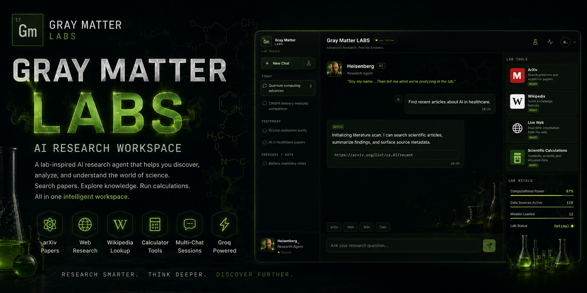
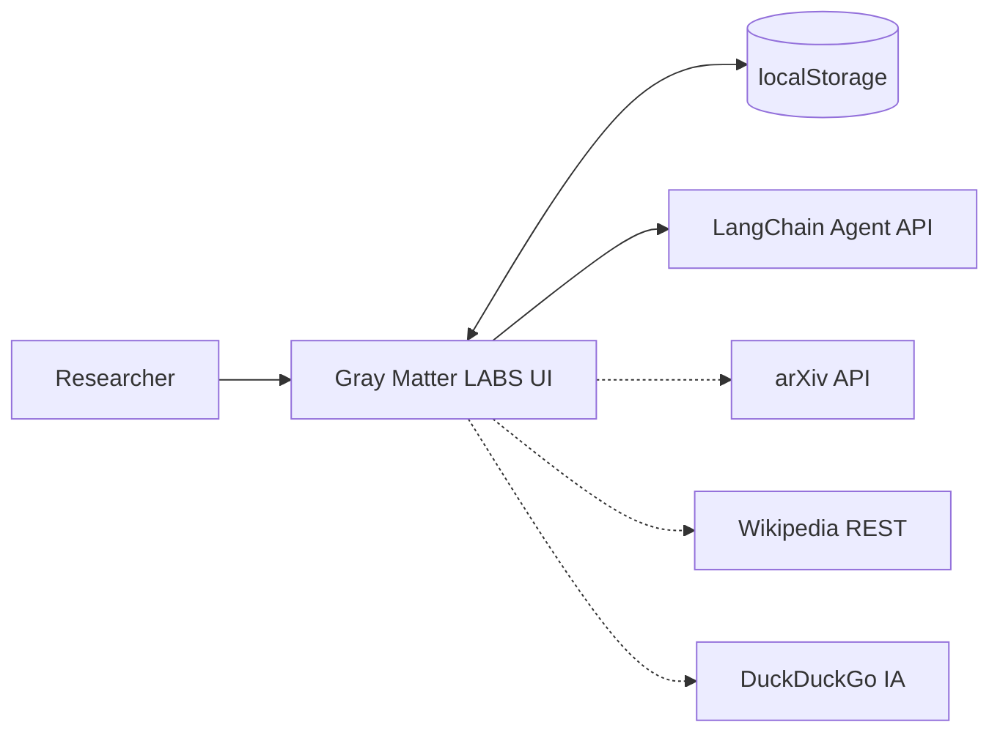

<p align="center">
  
</p>

<h1 align="center">Gray Matter LABS</h1>

<p align="center">
  <strong>React · Vite · LangChain Agent · ArXiv · Wikipedia · Live Web</strong><br />
  <em>A precision research chat workspace with a dark-lab aesthetic and multi-session notebooks.</em>
</p>

<p align="center">
  <a href="https://github.com/sidnei-almeida/gray-matter-research-agent"><strong>View on GitHub</strong></a>
  &nbsp;·&nbsp;
  <a href="https://salmeida-langchain-agent.hf.space">Agent API (Hugging Face)</a>
  &nbsp;·&nbsp;
  <a href="#deploy-on-vercel">Deploy on Vercel</a>
</p>

<p align="center">
  
  
  
  
  
  
  
</p>

---

## What this is

**Gray Matter LABS** is a modern research chat interface inspired by chemistry labs and precision science. The **Heisenberg Research Agent** helps you explore scientific literature, structured knowledge, live web signals, and calculations — inside a three-panel workspace designed for long research sessions.

The frontend owns **conversation state** (titles, messages, active session) and persists everything in **localStorage**. The backend stays **stateless**: each request carries recent context; the API does not manage sessions.

> **Production agent:** served from this same Vercel deployment at `/api` — set `VITE_API_BASE_URL` only if you point the frontend at a different backend origin.

---

## Layout & workflow

| Zone | Role |
|------|------|
| **Sidebar** | Session list grouped by date, New Chat, delete with lab-themed confirm dialog |
| **Chat workspace** | Agent intro, message thread, composer with shortcuts |
| **Lab Tools panel** | ArXiv · Wikipedia · Live Web · Calculator cards, suggested prompts, Lab Vitals |



---

## Main features

### Multi-session research notebook

- **New Chat** — creates a session with a welcome message from the agent
- **Auto-title** — first user message renames sessions still titled *New Research Session* (max 42 characters)
- **Persist on refresh** — conversations and active session survive browser reloads
- **Delete session** — custom lab dialog (no native `window.confirm`); safe fallback when deleting the last session

### Chat & agent

- User / assistant bubbles with loading and error states
- Last **8 messages** sent as `conversationHistory` to the agent (API-ready, backend may ignore until wired)
- **Research Agent** via `POST /api/chat` with graceful mock fallback when the API is unreachable
- Suggested prompts and composer shortcuts for faster input

### Lab tools (UI)

| Tool | Capability |
|------|------------|
| **ArXiv** | Preprint and paper discovery (`export.arxiv.org`) |
| **Wikipedia** | REST knowledge lookups |
| **Live Web** | DuckDuckGo Instant Answer (no API key) |
| **Scientific Calculations** | Client-side math via Math.js |

Tool routing and dedicated service modules live under `src/services/` for the next integration phase.

### Experience polish

- Dark lab theme — green accent, glass panels, periodic **87 / Gm** branding
- Themed scrollbars, selection, and focus rings (no default browser chrome clash)
- PWA-friendly manifest, favicons, and Open Graph image for sharing
- **Lab Vitals** and **Suggested Prompts** panels for atmosphere and quick starts

---

## Design system

Built for focused research: low-glare dark base, toxic green highlights, and monospace data where it matters.

| Element | Implementation |
|---------|----------------|
| **Typography** | IBM Plex Sans (UI) + IBM Plex Mono (labels, vitals) via Google Fonts |
| **Surfaces** | `--bg-panel` / `--bg-card` with subtle green borders |
| **Accent** | `--accent-green` · `--accent-toxic` on CTAs and active session |
| **Logo** | Periodic-table **87 / Gm** mark in sidebar and favicons |
| **Dialogs** | `LabConfirmDialog` — discard session flow matches lab palette |
| **Background** | Full-bleed lab imagery with dark green overlay |

Tokens: `src/styles/tokens.css`, `global.css`, `layout.css`, `native-theme.css`, `lab-dialog.css`.

---

## Tech stack

| Layer | Choice |
|-------|--------|
| Framework | React 19 + Vite 6 |
| Icons | Lucide React |
| Markdown | `react-markdown` + `remark-gfm` + `rehype-highlight` |
| Charts | Recharts (Lab Vitals) |
| Math | Math.js |
| State | React hooks + `localStorage` (no Redux) |
| Agent API | Node serverless functions in `api/` (same Vercel project) |
| Deploy | Vercel (SPA + serverless functions, `vercel.json`) |

---

## Agent API

The research agent runs as **Node serverless functions inside this repo** — no Python
runtime, no separate backend to deploy. The frontend calls it same-origin at `/api`.

| Endpoint | Method | Purpose |
|----------|--------|---------|
| `/api/health` | GET | Readiness + configured tools |
| `/api/tools` | GET | Tool catalogue |
| `/api/chat` | POST | Multi-turn chat — `{messages}` |
| `/api/query` | POST | Single question — `{question}` |
| `/api/research` | POST | Deep research — `{question, depth, max_sources}` |

Pipeline: **classify intent → plan → run tools → rank evidence → synthesize → verify**.
Tools are arXiv (ranked with relevance scoring), Wikipedia, web search, and a calculator.
Tooling questions (vector DBs, RAG stacks, FAISS) route web-first rather than arXiv-first.

Source lives in `api/` — handlers at the top level, pipeline modules under `api/_lib/`.

---

## Environment

```bash
cp .env.example .env
```

**Frontend** (build time, public — Vite inlines these, so changes need a redeploy):

| Variable | Description | Default |
|----------|-------------|---------|
| `VITE_API_BASE_URL` | Agent backend origin | *(empty — same-origin `/api`)* |

Leave `VITE_API_BASE_URL` unset for normal deployments. Only set it to point the
frontend at a different backend origin.

**Serverless functions** (runtime secrets — set these in the Vercel project settings):

| Variable | Required | Description |
|----------|----------|-------------|
| `GROQ_API_KEY` | **yes** | Powers classification, synthesis and revision |
| `GROQ_MODEL` | no | Defaults to `llama-3.3-70b-versatile` |
| `TAVILY_API_KEY` | no | Better web results; falls back to DuckDuckGo when unset |
| `GRAY_MATTER_API_KEY` | no | Gates the API behind `X-API-Key` / Bearer |
| `CORS_ORIGINS` | no | Comma-separated allowlist; `*` by default |

Without `GROQ_API_KEY` the API still searches and returns evidence, but cannot
synthesize prose — it degrades to a raw evidence summary.

---

## Quick start

```bash
git clone https://github.com/sidnei-almeida/gray-matter-research-agent.git
cd gray-matter-research-agent

npm install
cp .env.example .env   # optional — defaults work out of the box

npm run dev
```

Open [http://localhost:5173](http://localhost:5173).

### Production build

```bash
npm run build
npm run preview
```

### Regenerate favicons

Requires [ImageMagick](https://imagemagick.org/):

```bash
npm run generate:icons
```

---

## Deploy on Vercel

1. Import this repository on [Vercel](https://vercel.com/new).
2. Framework preset: **Vite** (or auto from `vercel.json`).
3. Add the environment variable **`GROQ_API_KEY`** (required — the agent needs it).
   Optionally add `TAVILY_API_KEY` for better web search.
4. Deploy. The SPA and the `/api` functions ship together from this one project.

```bash
npm i -g vercel
vercel
vercel --prod
```

To run the API locally alongside the frontend, use `vercel dev` instead of
`npm run dev` — plain Vite serves the SPA only, not the `/api` functions.

| Asset / config | Purpose |
|----------------|---------|
| `vercel.json` | Build `dist/`, function config, SPA rewrites, cache headers |
| `public/site.webmanifest` | Installable PWA metadata |
| `public/favicon.svg` · PNG set | Browser and mobile icons |
| `public/og-image.png` | Social preview |

---

## Repository structure

```
gray-matter-research-agent/
├── images/
│   └── header.png                 # README hero banner
├── public/                        # Static assets (favicons, manifest, og-image)
├── src/
│   ├── components/                # Sidebar, ChatWorkspace, LabToolsPanel, dialogs, …
│   ├── context/                   # LabDialogProvider (confirm flows)
│   ├── hooks/                     # useConversations (sessions + persistence)
│   ├── services/                  # API client, arXiv, Wikipedia, web, calculator, agent
│   ├── utils/                     # IDs, titles, date groups, tool routing
│   ├── styles/                    # Lab theme tokens and layout
│   └── data/                      # Suggested prompts, lab tools metadata
├── old-research-agent/            # Legacy HTML reference (GPL-3.0), local only
├── vercel.json
├── .env.example
└── index.html
```

---

## API surface (agent backend)

| Endpoint | Method | Purpose |
|----------|--------|---------|
| `/health` | GET | Service health check |
| `/api/chat` | POST | Multi-turn research queries |

The UI sends recent message history when the backend supports it. Session IDs are **not** required on the server.

---

## Scripts

| Command | Description |
|---------|-------------|
| `npm run dev` | Development server |
| `npm run build` | Production build → `dist/` |
| `npm run preview` | Preview production build |
| `npm run generate:icons` | Regenerate PNG favicons from `public/favicon.svg` |

---

## Roadmap

- Wire ArXiv / Wikipedia / Web / Calculator into the live chat routing
- Optional Node.js + SQLite backend for server-side sessions
- Auth and cloud sync (out of scope for current MVP)

---

## Disclaimer

Agent responses, tool outputs, and third-party API data are for **research assistance and demonstration only**. They are not medical, legal, or investment advice. Always verify claims against primary sources.

---

## License & author

See repository license. Legacy reference in `old-research-agent/` is **GPL-3.0**.

**Sidnei Alves de Almeida** — [@sidnei-almeida](https://github.com/sidnei-almeida)
